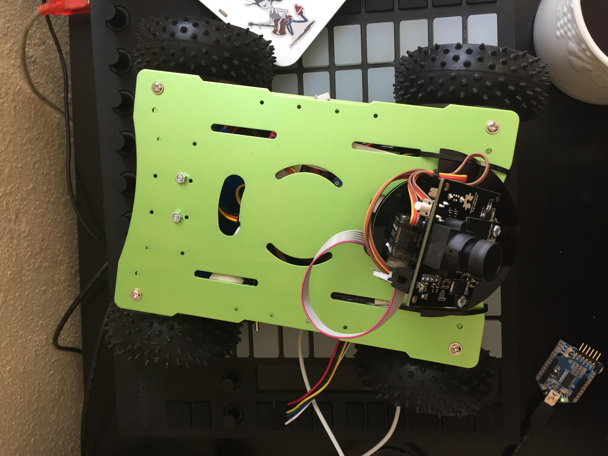

# rover
a little green robot with:
- Pixy
- IMU
- IR Range Finder
- Raspberry Pi 3

Build log / blog starts [here](http://b38tn1k.com/rover/2016/02/25/I-should-build-a-robot/)

/rover for embedded code (c++)

/remote for controller code and ncurses remote terminal (python)

/libraries for all 3rd party stuff

